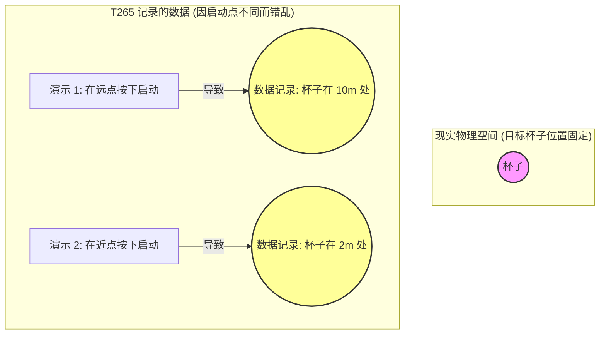
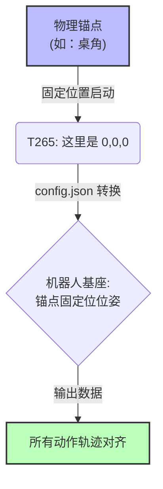

# 🛠️ FastUMI 数据采集：T265 坐标系对齐与复位指南

在使用基于 Intel RealSense T265 的手持设备（如 FastUMI）进行机器人操作数据采集时，**“对齐”（Alignment）或“复位”（Reset）是最关键的一步**。

本指南将通过图文为您详细说明为什么需要对齐，以及如何正确地进行物理操作。

---

## 1. 为什么要进行“对齐”？

T265 追踪相机（视觉里程计）没有内建的绝对坐标感。当你启动录制程序的瞬间，T265 会武断地宣布：
**“我现在所在的这个点就是宇宙的中心 (0,0,0)，我现在的朝向就是正前方！”**

### ❌ 如果不对齐（错误示范）

如果你随便找个地方按下了“开始录制”，那么每次生成的轨迹数据都会落在不同的坐标系中。机器人学习算法看到的数据就像下面这样混乱：

### ✅ 正确的对齐（锚点效应）

通过在每次点击“开始录制”之前，将手持设备放置在**同一个物理锚点**，我们就强行把 T265 的“随机坐标系”和“机器人的绝对坐标系”绑定在了一起。

---

## 2. 三种实用的物理对齐方案

为了确保每次启动时的位置和角度完全一致，以下是实验室中最常用的三种方案（按精度从低到高排列）：

### 方案一：桌面标记法（十字胶带）
**精度：⭐ | 成本：极低**

这是最简单的方案，适用于对绝对精度要求不极端的任务。

1. **准备**：在操作台面上，用有色胶带贴一个明显的“十”字作为对齐点。
2. **标定**：测量这个“十”字中心到机器人真实底座的物理距离（X, Y, Z），将数值填入 `config.json` 的 `base_position`。
3. **操作**：
   - 每次录制前，将手持夹爪的尖端（TCP）或者设备底部的固定点**垂直对准**十字中心。
   - 保持设备的朝向（例如：始终垂直于桌子边缘）。
   - 点击“开始录制”。

---

### 方案二：物理挡块法（推荐，最常用）
**精度：⭐⭐⭐⭐ | 成本：低**

这是性价比最高的方法，能有效限制位置和角度误差。

1. **准备**：在操作台边缘，使用重物（如两块方正的铅块）或 3D 打印一个直角底座（Dock），用强力双面胶固定在桌面上。
2. **标定**：测量挡块的内角顶点到机器人基座的距离，填入 `base_position`。
3. **操作**：
   - 每次录制前，将手持设备的手柄底部**紧紧靠住**挡块的直角内部。
   - 确保设备的背面贴紧挡块的一侧（保证朝向一致）。
   - 确认设备稳定后，点击“开始录制”。
   - 录制开始后，再把设备拿起来去执行操作。

---

### 方案三：机器人夹持法（最高精度）
**精度：⭐⭐⭐⭐⭐ | 成本：高（需要操作机械臂）**

如果你的终极目标是在真实机器人上进行毫米级的抓取，这是最严谨的方法。

1. **准备**：编写一个简单的脚本，让真实机械臂移动到一个固定的“Home”位置（例如正前方，姿态垂直向下）。
2. **操作**：
   - 在录制开始前，操作者拿着 FastUMI 采集器，将采集器的夹爪与真实机器人的夹爪（或法兰盘特定位置）**物理对接**（例如：互相咬合，或者靠死）。
   - 此时，采集器的位姿被机械臂死死限制住了。
   - 第二个人在电脑上点击“开始录制”。
   - 录制开始后，操作者移开采集器，去执行演示动作。
3. **配置**：此时 `config.json` 中的 `base_position` 就是机器人这个“Home”位置的精确坐标。

---

## 3. 常见问题排查 (Troubleshooting)

| 现象 | 可能原因 | 解决办法 |
| :--- | :--- | :--- |
| **机器人回放时，动作总是偏向一侧几厘米** | `base_position` 测量不准，或者物理锚点移动了。 | 重新拿卷尺精确测量锚点到机器人底座的距离并更新 config。 |
| **机器人回放时，高度（Z轴）越来越低，最后砸桌子** | T265 启动时的俯仰角（Pitch）没对准。启动时可能手抖让设备往下倾斜了。 | 使用**物理挡块法**，确保启动时设备是绝对垂直/水平的。 |
| **轨迹偶尔会“瞬移”或大范围漂移** | T265 在采集过程中镜头被遮挡，或者周围环境特征太少（如大面积白墙）。 | 保证相机视野清晰；在桌面上放一些有纹理的物体帮助 T265 定位。 |

---
**总结**：数据采集的真理是——**垃圾进，垃圾出 (Garbage In, Garbage Out)**。花 10 分钟搭建一个稳固的对齐挡块，能为你省去后期数天的除错时间。
