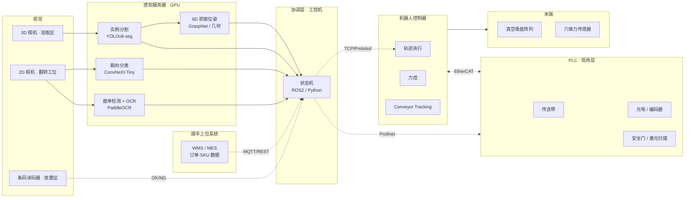
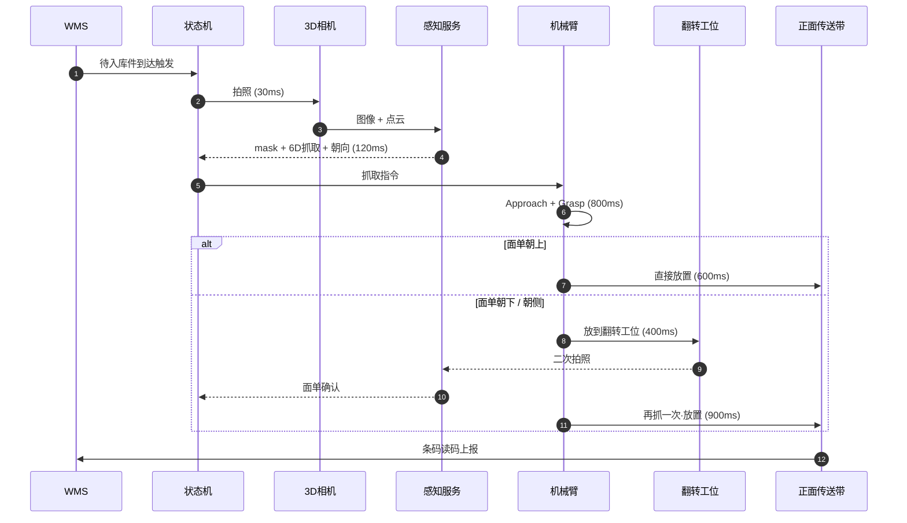
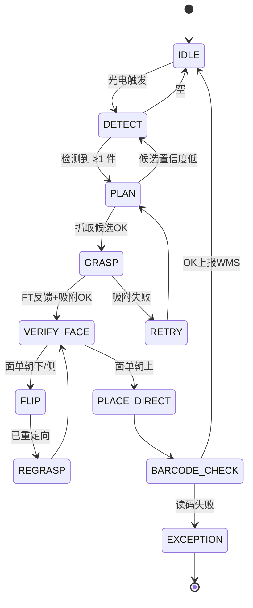
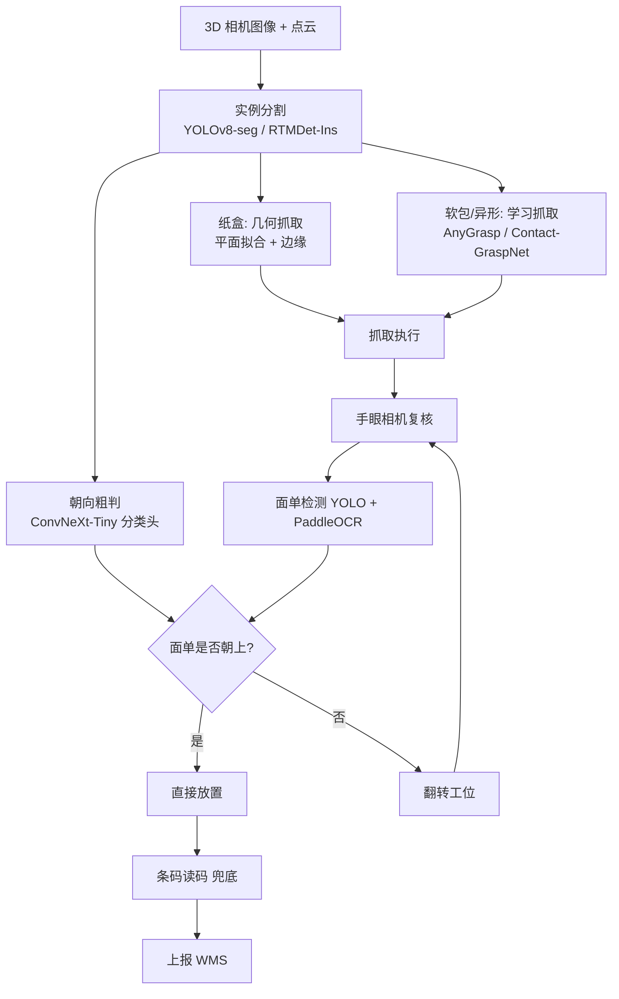
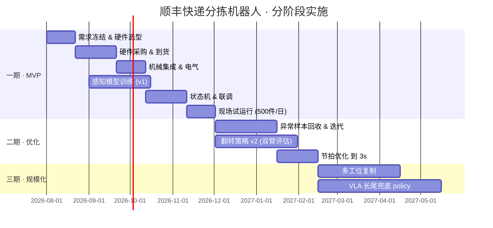

# 顺丰物流仓库 · 工业机器人快递分拣方案

> **场景**：仓库内正面 + 左侧双传送带，机器人从左侧传送带抓取快递件（纸盒 / 软包 / 文件封），将**面单朝上**（如需要则翻转）后放至正面传送带。
>
> **目标节拍**：≤ 3 s / 件（≈ 1200 件/小时·工位）
>
> **面单朝上准确率**：≥ 99.5%
>
> **综合抓取成功率**：≥ 98%

---

## 目录

1. [场景与需求拆解](#1-场景与需求拆解)
2. [系统总体架构](#2-系统总体架构)
3. [工作节拍与状态机](#3-工作节拍与状态机)
4. [硬件选型](#4-硬件选型)
5. [感知与算法栈](#5-感知与算法栈)
6. [面单朝向判定与翻转策略](#6-面单朝向判定与翻转策略)
7. [软件与通信架构](#7-软件与通信架构)
8. [风险与失效模式](#8-风险与失效模式)
9. [BOM 与预算估算](#9-bom-与预算估算)
10. [实施路线图](#10-实施路线图)

---

## 1. 场景与需求拆解

### 1.1 物理布局俯视图

```
                          正面传送带（放件·目的地）
                    ═══════════════════════════════▶
                    ┃                             ┃
                    ┃        [ 放置区 ]           ┃
                    ┃                             ┃
   左侧传送带      ┃    ┌──────────────┐         ┃
   （来件）        ┃    │              │         ┃
   ═════════▶     ┃    │   6-DoF 机械臂 │         ┃
       ▼           ┃    │   + 复合吸盘  │         ┃
   [ 拾取区 ]      ┃    └──────┬───────┘         ┃
       │           ┃           │                 ┃
       │           ┃      ┌────▼────┐            ┃
       └──────────▶┃      │翻转工位 │            ┃
                   ┃      │(被动V槽)│            ┃
                   ┃      └─────────┘            ┃
                   ┃                             ┃
                   ┃   [ 3D 相机·俯拍拾取区 ]     ┃
                   ┃   [ 2D 相机·俯拍翻转工位 ]   ┃
                   ┃   [ 条码读码器 · 放置区 ]   ┃
                   ┗━━━━━━━━━━━━━━━━━━━━━━━━━━━━━┛
```

### 1.2 子任务分解

| # | 子任务 | 关键挑战 | 主要能力 |
|---|--------|----------|----------|
| ① | 检测左侧传送带上的快件 | 纸盒/软包混杂、堆叠、遮挡、反光 | 2D/3D 实例分割 |
| ② | 估计 6-DoF 抓取位姿 | 软包无固定形状；纸盒有边角约束 | 抓取位姿估计 + 几何拟合 |
| ③ | 稳定抓取 | 软包变形、漏气；纸盒 5–10 kg 载荷 | EOAT + FT 反馈 |
| ④ | **判定面单朝向** | 面单可能在 6 个面之任一 | 面单检测 + 姿态分类 |
| ⑤ | **翻转 / 再定向** | 空中重定向不稳；软包尤甚 | 被动翻转工位 或 双臂交接 |
| ⑥ | 放到正面传送带 | 传送带在动，需节拍匹配 | Conveyor Tracking |

---

## 2. 系统总体架构



**分层原则**

- **实时层（PLC / 机器人控制器）**：EtherCAT / Profinet，负责毫秒级动作与安全。
- **决策层（工控机 + GPU）**：万兆 / GigE Vision，负责感知与状态机。
- **业务层（WMS）**：MQTT / REST，只做元数据与统计。

---

## 3. 工作节拍与状态机

### 3.1 单件时序（目标 ≤ 3 s）



### 3.2 主状态机



---

## 4. 硬件选型

### 4.1 机械臂

| 方案 | 负载 | 臂展 | 重复定位 | 节拍 | 备注 |
|------|------|------|----------|------|------|
| **FANUC M-10iD/12** ⭐ | 12 kg | 1441 mm | ±0.03 mm | 快 | 首选，SDK 开放度好 |
| ABB IRB 1300 | 10–12 kg | 1400 mm | ±0.02 mm | 很快 | PickMaster 成熟 |
| UR10e | 10 kg | 1300 mm | ±0.05 mm | 中 | 协作臂，人机混线用 |
| 埃斯顿 ER10 | 10 kg | 1450 mm | ±0.05 mm | 中快 | 国产替代，性价比高 |
| **双臂**（评估） | — | — | — | — | 翻面场景可省翻转工位 |

**推荐**：主线 **FANUC M-10iD/12 + 被动翻转工位**；预算充裕可评估双臂方案。

### 4.2 末端执行器（EOAT）

```
      ┌──────────────────────────┐
      │   六维力/力矩传感器      │  ← ATI Mini45 / Robotiq FT300
      ├──────────────────────────┤
      │   快换接口               │
      ├──────────────────────────┤
      │  ▓  ▓  ▓  ▓              │  ← 4~9 独立通断吸盘
      │  ▓  ▓  ▓  ▓              │     Piab piCOBOT / SMC ZP3
      │  ▓  ▓  ▓  ▓              │
      └──────────────────────────┘
      + 气路压力/流量双反馈传感器
```

- 复合吸盘阵列：应对纸盒（大面积）与软包（小面积 + 大压差）
- 六维力：抓取碰撞检测 + 软包接触判定
- 备选：吸盘 + 二指自适应夹爪 快换（OnRobot VGC10 + RG2）

### 4.3 视觉与传感

| 位置 | 类型 | 型号建议 | 用途 |
|------|------|----------|------|
| 拾取区俯拍 | 工业 3D（结构光 / ToF） | **Photoneo MotionCam-3D** / Zivid 2+ / Mech-Eye LSR | 分割 + 6D 位姿 |
| 手眼（可选） | 2D 高分辨率 | Basler ace 2 R (5 MP) | 抓起后近距看面单 |
| 翻转工位上方 | 2D 彩色 | Basler + LED 环光 | 面单朝向确认 |
| 放置区 | 条码读码器 | **Cognex DataMan 370** / Keyence SR-2000 | 一维 / 二维码兜底 |
| 传送带主轴 | 增量编码器 | 倍加福 / 欧姆龙 | 跟踪速度反馈 |
| 安全 | 激光扫描仪 | **SICK microScan3** | 安全区域 |

> 消费级 RealSense D435/D455 **不建议**用在工业分拣现场：软包高反光 + 低纹理会导致点云空洞。

### 4.4 计算与网络

- **GPU 服务器**：Xeon 8 核 + RTX 4090 / A5000 / L4 × 1（推理够用）
- **网络双平面**：
  - 实时平面：EtherCAT / Profinet（机器人 ↔ PLC）
  - 视觉平面：万兆以太网 / GigE Vision（相机 ↔ GPU）

---

## 5. 感知与算法栈

### 5.1 算法分层



### 5.2 各层技术选择

| 层 | 首选 | 替代 | 训练数据量 |
|----|------|------|------------|
| 实例分割 | YOLOv8-seg（微调） | RTMDet-Ins / SAM2 提示分割 | 5–10k 张现场标注 |
| 抓取位姿（纸盒） | 几何 + PCL 平面拟合 | — | 无需训练 |
| 抓取位姿（软包） | AnyGrasp 预训 + 微调 | GraspNet-1B / Contact-GraspNet | 2–5k 抓取标注 |
| 面单朝向 | ConvNeXt-Tiny 6 分类 | EfficientNet-B0 | 3–5k crop |
| 面单 OCR | PaddleOCR 中英文 | RapidOCR | 无需自训 |
| 条码 | Cognex DataMan 硬件 | pyzbar / Dynamsoft | 无需训练 |

### 5.3 为什么当前阶段不主线上 VLA

| 维度 | 传统栈 | VLA / 端到端 |
|------|--------|--------------|
| 节拍 | 150–300 ms 感知 | 秒级 |
| 可解释 | 每步可可视化 | 黑盒 |
| 失败回归 | 打标签→微调分割/OCR | 需重训策略 |
| 现场部署 | 成熟工具链 | 依赖 GPU 强算力 |

**建议**：VLA（如 π0 / OpenVLA / 自研 ACT / Diffusion Policy）作为**长尾兜底 + 未来演进方向**，先跑传统栈；异常样本沉淀数据后再训 policy。

---

## 6. 面单朝向判定与翻转策略

### 6.1 朝向分类（6 面 → 4 类简化）

```
        ┌─────────┐
        │  TOP ↑  │  ← 直接放置
        └─────────┘
   ┌───┐┌─────────┐┌───┐
   │ L │ │  FRONT │ │ R │  ← 侧面 (90°翻)
   └───┘└─────────┘└───┘
        ┌─────────┐
        │ BOTTOM ↓│  ← 180°翻
        └─────────┘
        ┌─────────┐
        │  BACK   │  ← 180°翻
        └─────────┘
```

### 6.2 决策表

| 朝向 | 动作 | 节拍开销 | 复杂度 |
|------|------|----------|--------|
| 朝上 ↑ | 直接放置 | 基线 | ★ |
| 朝下 ↓ | 翻转工位 180° 后重抓 | +0.8 s | ★★ |
| 侧面 | V 槽倒下 + 重抓 | +0.6 s | ★★ |
| 未知 | 送翻转工位复拍 | +1.0 s | ★★★ |

### 6.3 被动翻转工位机械示意

```
         抓臂放件方向
             │
             ▼
     ┌──────────────┐
     │ ╲          ╱ │  ← V 槽（角度可调 60°）
     │  ╲        ╱  │
     │   ╲      ╱   │  ← 快件自然倒向下方
     │    ╲    ╱    │
     │     ╲__╱     │
     │  ┌────────┐  │  ← 平台 + 挡板（180°翻用）
     │  │ 2D相机 │  │  ← 顶部拍摄确认
     │  │  ▼     │  │
     └──┴────────┴──┘

  优点: 无源、便宜、稳定；软包/纸盒通吃
  成本: ≈ 3~8 k RMB 钣金定制
```

### 6.4 训练数据获取建议

- **合成数据 + Domain Randomization**：面单本身是高对比度矩形 + 条码 + 文字，合成 80% + 现场 20% 即可
- **主动加脏数据**：胶带覆盖、磨损、褶皱、油污
- **优先条码**：顺丰面单本身有条码，条码识别可作为 OCR 的**兜底 + 交叉验证**

---

## 7. 软件与通信架构

### 7.1 通信协议矩阵

| 链路 | 协议 | 延迟要求 | 数据量 |
|------|------|----------|--------|
| PLC ↔ 机器人控制器 | Profinet / EtherCAT | < 1 ms | 小 |
| 机器人 ↔ 协调层 | TCP + Protobuf | < 10 ms | 中 |
| 感知 ↔ 协调层 | ROS2 DDS / gRPC | < 50 ms | 大（点云） |
| 相机 ↔ 感知 | GigE Vision / USB3 | < 20 ms | 大 |
| WMS ↔ 协调层 | MQTT / REST | 秒级 | 小 |

### 7.2 目录结构建议

```
sf-sorting-cell/
├── perception/          # 感知服务 (Python + Torch)
│   ├── segmentation/
│   ├── grasp/
│   ├── face_orient/
│   └── ocr/
├── planner/             # 状态机 (ROS2 nodes)
│   ├── fsm.py
│   └── conveyor_tracker.py
├── robot_driver/        # 机器人厂商 SDK 封装
│   └── fanuc_stream_motion/
├── plc_bridge/          # PLC 桥 (Profinet ↔ MQTT)
├── configs/             # 相机内参、手眼标定、传送带参数
├── datasets/            # 数据集与标注
└── ops/                 # 部署、监控、日志
```

---

## 8. 风险与失效模式

| 风险 | 影响 | 缓解措施 |
|------|------|----------|
| 软包吸附失败 | 抓取率↓ | 多吸盘 + 气流/压力双反馈 + FT 判定 + 重试逻辑 |
| 快件叠罗汉 | 分割失败 | **上游加分离机构 (singulator)**，比死磕算法便宜 |
| 面单被胶带 / 磨损 | OCR 失败 | 条码优先 + OCR 兜底 + 异常件走人工工位 |
| 面单被压皱翘边 | 部分识别 | 环光 + 多角度补光；仍失败则走人工 |
| 传送带速度波动 | 跟踪失败 | 编码器实时反馈 + 卡尔曼滤波 |
| 相机受污染 | 全线停 | 每班次吹气清洁 + 图像质量在线监测 |
| 网络抖动 | 状态机卡死 | 心跳 + 看门狗 + 断点续跑 |
| 安全 | 人员伤害 | 围栏 + 安全 PLC + SICK 激光扫描 + 急停 |

---

## 9. BOM 与预算估算

> 报价为大致市场价（含税），实际以采购为准。

| 类别 | 型号 / 规格 | 单价 (RMB) | 数量 | 小计 |
|------|-------------|-----------:|:----:|-----:|
| 机械臂 | FANUC M-10iD/12 + R-30iB 控制器 | 180,000 | 1 | 180,000 |
| EOAT | Piab 多吸盘阵列 + 快换 | 25,000 | 1 | 25,000 |
| 力传感器 | ATI Mini45 | 40,000 | 1 | 40,000 |
| 3D 相机 | Photoneo MotionCam-3D M | 90,000 | 1 | 90,000 |
| 手眼 2D | Basler ace 2 R + 镜头 + 光源 | 12,000 | 1 | 12,000 |
| 翻转工位 2D | Basler + 环光 | 10,000 | 1 | 10,000 |
| 条码读码器 | Cognex DataMan 370 | 25,000 | 1 | 25,000 |
| GPU 工控机 | Xeon + RTX 4090 + 万兆网卡 | 45,000 | 1 | 45,000 |
| PLC | 西门子 S7-1500 + 安全模块 | 30,000 | 1 | 30,000 |
| 安全激光 | SICK microScan3 | 35,000 | 1 | 35,000 |
| 传送带编码器 + 光电 | — | 8,000 | 1 | 8,000 |
| 被动翻转工位 | 钣金定制 + V 槽 | 6,000 | 1 | 6,000 |
| 围栏 / 电控柜 / 安装 | — | 60,000 | 1 | 60,000 |
| 集成 / 软件开发 | — | 300,000 | 1 | 300,000 |
| **合计（单工位）** | | | | **≈ 866,000** |

**规模化说明**：多工位并行时，GPU 服务器与 WMS 桥可共享，单工位边际成本可降至 **50–60 万**。

---

## 10. 实施路线图



### 里程碑 KPI

| 阶段 | 时间 | KPI |
|------|------|-----|
| 一期结束 | T+4 月 | 单件 5 s，成功率 95%，面单朝上 98% |
| 二期结束 | T+8 月 | 单件 3 s，成功率 98%，面单朝上 99.5% |
| 三期结束 | T+12 月 | 4 工位并行，日处理 ≥ 40 万件 |

---

## 附录 A · 术语表

| 缩写 | 含义 |
|------|------|
| EOAT | End-of-Arm Tooling，末端执行器 |
| FT | Force / Torque，六维力传感器 |
| WMS | Warehouse Management System |
| MES | Manufacturing Execution System |
| FSM | Finite State Machine，有限状态机 |
| VLA | Vision-Language-Action model |
| ACT | Action Chunking Transformer |
| DP | Diffusion Policy |

## 附录 B · 关键决策清单（Checklist）

- [ ] 是否有单件化（singulator）机构？没有则先加。
- [ ] 面单是否 100% 有条码？OCR 是主还是备？
- [ ] 是否允许在传送带上做二次翻转（工位空间）？
- [ ] 现场 24 h 光照条件是否稳定？是否需要遮光罩？
- [ ] 网络是否双平面（实时 + 视觉）分离？
- [ ] 是否有人机混线？决定协作臂 vs 工业臂。
- [ ] 数据回传合规性（顺丰内部数据、快递面单隐私）。

---

> **编制**：Hermes Agent
> **版本**：v1.0
> **日期**：2026-07-16
