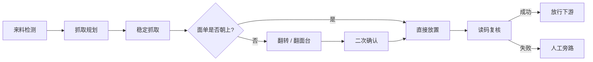
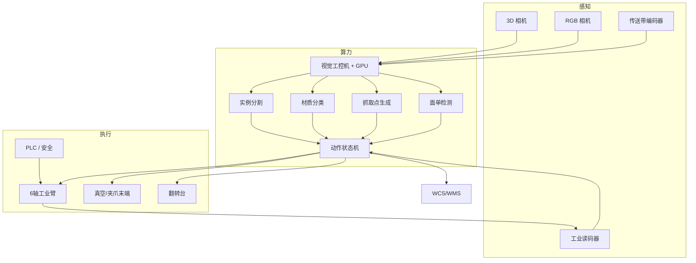
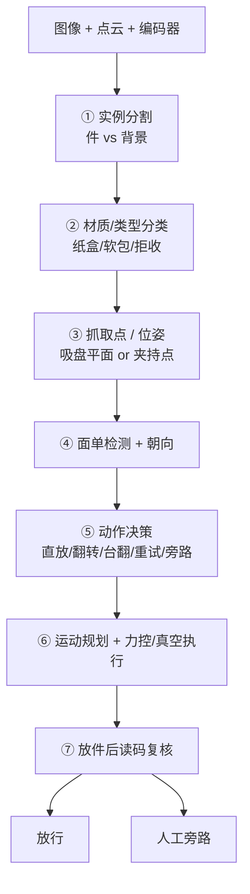
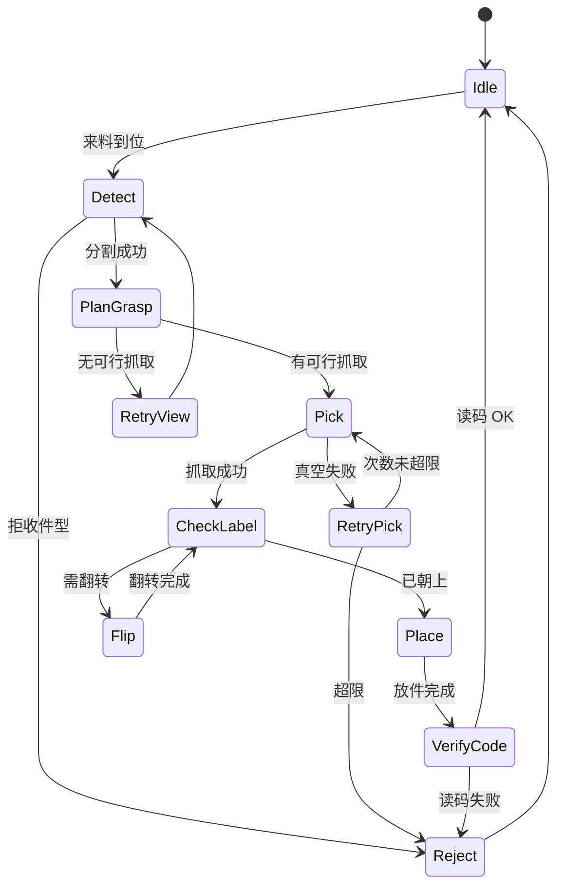

# 物流仓库工业机器人分拣方案

> **场景**：顺丰类物流仓库 · 快递件自动供件（面单朝上规整）  
> **目标**：从左侧传送带抓取纸盒/软包装件，保证有快递面单的一面朝上，放置到正面传送带  
> **文档版本**：v1.0 · 2026-07

---

## 1. 方案概述

### 1.1 业务目标

在物流分拣中心部署固定式工业机器人工作站，替代人工完成「取件 → 面单朝上规整 → 供件」流程，提升节拍稳定性、降低漏扫/错分，并适配纸箱与软包等常见件型。

```
┌──────────────────────────────────────────────────────────────────────────┐
│                        业务价值一览                                        │
├─────────────────┬─────────────────┬─────────────────┬────────────────────┤
│  降本增效        │  质量提升        │  连续作业        │  可扩展            │
│  减少重复劳力    │  面单朝上可读    │  7×24 稳态节拍  │  多机并联扩容      │
│  降低翻车疲劳    │  读码闭环验收    │  少受人员波动    │  对接 WCS/WMS     │
└─────────────────┴─────────────────┴─────────────────┴────────────────────┘
```

### 1.2 工位示意

```
                        俯视图 (Top View)

     ╔══════════════════════════════════════╗
     ║         正面传送带 (放件 / 供件)        ║  ──► 下游分拣 / 读码
     ║    ● ● ● ● ● ● ● ● ● ● ● ● ● ● ●    ║
     ╚══════════════════════════════════════╝
                        ▲
                        │ 放置
                   ┌────┴────┐
                   │  6轴臂  │
                   │ + 抓手  │
                   │  视觉   │
                   └────┬────┘
                        │ 抓取
                        │
     ╔══════════════════╧═══════════════════╗
     ║         左侧传送带 (来料)               ║  ◄── 上游供件
     ║    ■ □ ■ ■ □ ■  (纸盒/软包混杂)       ║
     ╚══════════════════════════════════════╝

     图例: ■ 纸盒   □ 软包   ● 已规整件
```

### 1.3 任务拆解



| 子任务 | 输入 | 输出 | 关键难点 |
|--------|------|------|----------|
| 检测与定位 | 左侧传送带图像/点云 | 位姿 / 抓取点 | 堆叠、遮挡、运动皮带 |
| 材质识别 | RGB + 点云 | 纸盒 / 软包 / 拒收 | 软包形变、反光袋 |
| 面单与朝向 | 多视角图像 + 读码 | 是否朝上、目标姿态 | 褶皱、污损、多标签 |
| 抓取执行 | 抓取点 + 材质策略 | 稳定夹持 | 漏吸、塌陷、掉件 |
| 翻转重定向 | 当前朝向 vs 目标 | 面单朝上 | 软包空中翻面难 |
| 放置与验收 | 目标位 + 读码结果 | 规整供件 | 节拍与同步 |

---

## 2. 系统总体架构

### 2.1 分层架构

```
┌─────────────────────────────────────────────────────────────────┐
│  L5  业务层          WMS / WCS · 单号 · 格口 · 异常工单          │
├─────────────────────────────────────────────────────────────────┤
│  L4  调度层          状态机 · 任务队列 · 重试 · 旁路策略          │
├─────────────────────────────────────────────────────────────────┤
│  L3  智能层          分割 · 分类 · 抓取 · 面单 · 动作决策         │
├─────────────────────────────────────────────────────────────────┤
│  L2  控制层          机器人轨迹 · 真空/夹爪 · 翻转台 · PLC 安全   │
├─────────────────────────────────────────────────────────────────┤
│  L1  设备层          6轴臂 · 抓手 · 3D/2D 相机 · 读码器 · 皮带   │
└─────────────────────────────────────────────────────────────────┘
```

### 2.2 数据与控制流



### 2.3 推荐工位布局（侧视逻辑）

```
        补光灯 / 3D+2D 俯视相机
              │
              ▼
    ══════════╤══════════  安全围栏 / 光幕
              │
         ┌────┴────┐
         │ 机械臂  │──────── 腕部 F/T（可选）
         │         │
         └────┬────┘
           抓手│
    ──────────┼────────────────  工作高度
    左侧来料   │    翻转台(可选)    正面放件
    ══════════╧════════════════════════
         编码器              读码复核位
```

---

## 3. 硬件方案

### 3.1 硬件总览

```
                    ┌──────────────────────┐
                    │   工业机器人工作站    │
                    └──────────┬───────────┘
         ┌─────────────────────┼─────────────────────┐
         ▼                     ▼                     ▼
   ┌───────────┐         ┌───────────┐         ┌───────────┐
   │  运动执行  │         │  感知传感  │         │  辅助工装  │
   ├───────────┤         ├───────────┤         ├───────────┤
   │ 6轴工业臂  │         │ 3D 结构光  │         │ 翻转台     │
   │ 真空多吸盘 │         │ RGB 相机   │         │ 单件分离   │
   │ 软包夹爪   │         │ 读码器     │         │ 挡停/旁路  │
   │ (可选快换) │         │ 编码器     │         │ 安全围栏   │
   │ 力/力矩    │         │ 真空传感器 │         │ 光幕/急停  │
   └───────────┘         └───────────┘         └───────────┘
```

### 3.2 机械臂选型

| 项目 | 推荐规格 | 说明 |
|------|----------|------|
| 类型 | **6 轴工业臂**（首选） | 翻转自由度足够；协作臂适合人机混场试点 |
| 有效负载 | **≥ 8–10 kg** | 件重 0.1–5 kg + 抓具 + 力控余量 |
| 臂展 | **约 1.2–1.8 m** | 覆盖左取 + 前放 + 空中/台面翻转空间 |
| 重复精度 | ±0.05 mm 级 | 物流场景足够 |
| 安装 | 地装；跨距大时加第七轴地轨 | 需做 reach envelope 仿真 |
| 参考量级 | FANUC / KUKA / ABB / 埃斯顿 / 汇川等同级 | 按品牌服务与集成生态选型 |

**选型决策树：**

```
                    是否需要人机共用无围栏?
                   /                        \
                 是                          否
                  │                           │
            协作臂试点                    工业臂量产
                  │                           │
            节拍要求高? ──否──► 维持协作臂
                  │是
                  ▼
            隔离后改工业臂
```

### 3.3 末端执行器（成败关键）

单一抓手难以同时覆盖纸盒与软包，推荐 **真空为主、夹持为辅** 的混合策略。

```
              ┌─────────────────────────────┐
              │     多功能末端（推荐）        │
              │                             │
              │   ┌─────┐ ┌─────┐ ┌─────┐  │
              │   │吸盘1│ │吸盘2│ │吸盘3│  │  ← 多区独立真空
              │   └──┬──┘ └──┬──┘ └──┬──┘  │
              │      └───────┴───────┘     │
              │            │               │
              │     真空度实时反馈           │
              │            │               │
              │   ┌────────┴────────┐      │
              │   │ 可选：柔性夹爪   │      │  ← 难吸软包 / 文件封
              │   └─────────────────┘      │
              └─────────────────────────────┘
```

| 组件 | 规格建议 | 适用 |
|------|----------|------|
| 真空吸盘阵列 | 多区独立、泡沫/波纹吸盘 | 纸盒平面、较平整袋面 |
| 软包增强 | 大面积多孔吸盘 / 软指夹 | 褶皱袋、易塌陷件 |
| 真空检测 | 压力/流量实时反馈 | 失败快速重试 |
| 腕部 F/T | 可选 | 轻柔抓取、防压坏 |
| 快换 ATC | 节拍允许时 | 件型切换 |

| 件型 | 优先策略 |
|------|----------|
| 规则纸盒 | 真空吸盘 |
| 较平整塑料/防水袋 | 真空 + 偏振补光 |
| 严重褶皱软包 | 夹持 / 翻转台辅助 |
| 超薄文件封 | 专用吸盘或夹指 |
| 异形 / 超限 | **拒收旁路**，不进主流程 |

### 3.4 视觉与传感

| 传感器 | 安装位置 | 作用 |
|--------|----------|------|
| **3D 相机**（主） | 左侧取件区上方 Eye-to-Hand | 点云分割、位姿、堆叠解算 |
| **RGB 相机** | 取件区俯视 + 可选臂上 | 面单、纹理、材质 |
| **侧视 / 底视**（可选） | 立面或镂空托盘下方 | 判断底面是否有面单 |
| **工业读码器** | 放件后固定位 | **业务验收金标准**：面单朝上且可读 |
| **传送带编码器** | 两侧皮带 | 运动跟踪、不停带抓放 |
| **真空传感器** | 末端气路 | 抓取成败判据 |

**光学注意：**

- 全局快门，适应皮带运动  
- **偏振 + 漫射补光**，抑制快递袋反光  
- 工作距离约 0.8–2 m，点云 mm 级精度  

### 3.5 辅助工装（强烈建议）

```
  来料 ──► [挡停/排队] ──► [单件分离] ──► [视觉工位]
                                              │
                         ┌────────────────────┤
                         ▼                    ▼
                   纸盒：臂内翻转         软包：翻转台 180°
                         │                    │
                         └────────┬───────────┘
                                  ▼
                           [读码复核] ──失败──► [人工旁路]
                                  │成功
                                  ▼
                             正面传送带
```

| 装置 | 作用 |
|------|------|
| 单件分离 / 挡边 | 降低堆叠抓取难度 |
| **翻转台** | 软包 180° 翻面，比空中拧更稳 |
| 拒收/人工口 | 多次失败、异形、超重 |
| 安全围栏 + 光幕 + 安全 PLC | 工业臂标配 |

### 3.6 参考 BOM（试点级）

| 类别 | 配置示例 |
|------|----------|
| 机械臂 | 6 轴，10–15 kg，臂展 ~1.4 m |
| 抓手 | 4–6 区独立真空 + 真空传感；预留夹爪接口 |
| 视觉 | 1× 结构光 3D + 1× ≥500 万全局快门 RGB + 偏振补光 |
| 复核 | 固定工业读码器 |
| 辅助 | 伺服/气动翻转台、挡停、旁路滑槽 |
| 算力 | 工控机 + NVIDIA GPU（本地推理） |
| 控制 | 原厂机器人控制器 + PLC/安全 PLC |

---

## 4. 软件与 AI 模型方案

### 4.1 感知流水线（模块化）

> **原则**：模块化可维护、可降级、可读码闭环；**不**建议起步即用端到端 VLA 直接控臂。



### 4.2 模型选型一览

| 模块 | 推荐方案 | 备注 |
|------|----------|------|
| 件检测 / 分割 | YOLOv8/v11-seg、RT-DETR 等 | 实时；软包边界优先实例分割 |
| 难例 / 新品类 | SAM2 / FastSAM 辅助 | 冷启动与开放场景 |
| 3D 位姿 | 平面/包围盒 + 可选 6D 方法 | 纸盒可用模板；软包用抓取点 |
| 抓取生成 | 吸盘平面性评分 / AnyGrasp 类 | 真空选最大可吸区 |
| 面单检测 | 专用检测头 + 条码区域 | 比纯 OCR 更稳 |
| OCR（可选） | PaddleOCR 等 | 需单号与 WMS 校验时启用 |
| 运动规划 | 厂商轨迹 + MoveIt 等 | 现场以厂商 SDK 为主 |
| 策略调度 | **有限状态机 + 规则** | 可解释、可回放；后期再优化节拍 |

### 4.3 「面单朝上」决策逻辑

```
┌─────────────────────────────────────────────────────────┐
│                    面单朝上判定                           │
└─────────────────────────────────────────────────────────┘
              │
              ▼
     顶面是否有面单 且 读码可信?
              │
       ┌──────┴──────┐
      是              否
       │              │
       ▼              ▼
   保持姿态抓放    底/侧是否有面单?
                     │
              ┌──────┴──────┐
             是              否
              │              │
              ▼              ▼
        规划翻转        多视角重拍 /
        (臂内或台面)     旋转寻找 /
              │         转人工
              ▼
        二次俯视 + 读码
              │
       ┌──────┴──────┐
    成功              失败
       │              │
       ▼              ▼
    放行下游        旁路人工
```

**工程要点：**

- 以 **工业读码成功** 作为「面单朝上」的 ground truth，而不仅依赖视觉分类。  
- **纸盒**：优先臂内 6 轴翻转。  
- **软包**：优先 **抓取 → 翻转台 → 再抓放**，降低空中形变失败率。

### 4.4 动作状态机（简化）



### 4.5 数据与训练

| 数据类型 | 内容 |
|----------|------|
| 场景图 | 各仓灯光、皮带纹理、顺丰袋/纸盒/防水袋 |
| 标注 | 实例 mask、材质、面单框、朝上标签、抓取成败 |
| 闭环数据 | 读码结果、真空曲线、失败原因码 |
| 仿真（可选） | Isaac Sim / MuJoCo 预研抓取与翻转 |

**域适应建议**：分拨中心灯光与包装会变，需持续采集难例回流训练。

---

## 5. 关键流程时序

### 5.1 单件标准节拍（示意）

```
时间轴 ────────────────────────────────────────────────────────►

检测分割  ███
抓取规划    ██
移动取件      ████
抓取确认          █
抬升扫面           ██
翻转(如需)           ████████
移动放件                     ████
放件确认                         █
读码复核                           ██
就绪下件                             █

 无翻转: 约 4–6 s/件（目标区间，视皮带与臂速）
 有翻转: 约 6–10 s/件（含翻转台则另计）
```

### 5.2 与传送带协同

| 模式 | 描述 | 适用 |
|------|------|------|
| **停带取放** | 到位停 → 抓放 → 再启 | 试点、精度优先 |
| **不停带跟踪** | 编码器 + 视觉预测轨迹 | 量产提速 |
| **节拍缓冲** | 来料挡停排队 | 上游不稳时 |

---

## 6. 分阶段实施路线

```
  阶段 A 试点 (3–6 月)          阶段 B 量产增强           阶段 C 预研
 ┌─────────────────────┐    ┌─────────────────────┐   ┌─────────────────┐
 │ · 单工位工业臂       │    │ · 动态皮带跟踪       │   │ · 双臂协作软包   │
 │ · 真空多吸盘         │───►│ · 吸盘/夹爪快换      │──►│ · 学习型抓取     │
 │ · 3D+2D+读码        │    │ · 多机并联           │   │ · 大模型异常解释 │
 │ · 翻转台            │    │ · 深对接 WCS/WMS     │   │ · (非主控)       │
 │ · 纸盒+可吸软包     │    │ · KPI 持续优化       │   │                 │
 │ · 异形旁路          │    │                     │   │                 │
 └─────────────────────┘    └─────────────────────┘   └─────────────────┘
```

### 阶段 A 范围边界

| 纳入 | 暂不纳入 |
|------|----------|
| 常规纸盒 | 严重异形件 |
| 较平整软包 | 超重 / 超尺寸 |
| 停带或低速皮带 | 端到端 VLA 主控 |
| 读码闭环验收 | 无人化全仓（仅本工位） |

---

## 7. KPI 与验收

| 指标 | 试点目标（建议） | 说明 |
|------|------------------|------|
| 纸盒抓取成功率 | ≥ **98%** | 含一次重试 |
| 软包抓取成功率 | ≥ **95%** | 可吸范围内 |
| 面单朝上且可读 | ≥ **99%** | 以读码器为准 |
| 单件节拍 | **4–8 s**（视是否翻转） | 与产能规划对齐 |
| 掉件 / 破损率 | ≤ 人工基线 | 安全与客诉 |
| 系统可用率 | ≥ **98%** | 排除计划维护 |

**验收闭环：**

```
视觉判定朝上 ──► 机械执行 ──► 工业读码 ──► 计入成功
                              │
                              └── 失败 ──► 旁路 + 原因码统计
```

---

## 8. 风险与对策

| 风险 | 影响 | 对策 |
|------|------|------|
| 软包装漏吸 | 掉件、节拍抖动 | 多区真空 + 反馈重试；难件转夹持/翻转台 |
| 防水袋反光 | 深度/检测失效 | 偏振光、曝光策略、多帧融合 |
| 面单污损遮挡 | 无法读码 | 限次尝试后人工；不盲目多次翻转 |
| 皮带同步误差 | 抓偏 | 编码器标定、全局快门、动态补偿 |
| 翻转拖累产能 | 吞吐下降 | 统计来料朝上率；减少无效翻转 |
| 件型超出设计 | 故障率升高 | 明确尺寸重量窗口；超限旁路 |
| 人机安全 | 合规风险 | 围栏/光幕/安全 PLC；协作臂仅限场景允许时 |

---

## 9. 方案对比与结论

### 9.1 关键选择对照

| 维度 | **推荐** | 不推荐作为主路径（现阶段） |
|------|----------|----------------------------|
| 机器人形态 | 固定 **6 轴工业臂** | 人形双足主生产、纯 Delta 大件翻转 |
| 抓手 | **真空阵列为主** + 软包增强 | 单一刚性夹爪包打天下 |
| 视觉 | Eye-to-Hand **3D+2D** + **读码复核** | 仅 2D 猜朝向 |
| 翻转 | 纸盒臂内；**软包翻转台** | 软包长时间空中拧转 |
| 模型 | **模块化**检测/分割/抓取 | 端到端 VLA 直接量产控臂 |
| 验收 | **读码成功 = 面单朝上** | 仅靠分类模型置信度 |

### 9.2 一句话结论

> 以 **固定六轴工业臂 + 多区真空末端 + 3D/2D 视觉 + 工业读码闭环 + 软包翻转台** 为主路径，用 **模块化视觉与状态机** 实现「左侧取件、面单朝上、正面供件」；先纸盒与可吸软包试点，再扩展动态跟踪与多机并联。

---

## 10. 附录

### 10.1 术语表

| 术语 | 含义 |
|------|------|
| 供件 | 将包裹规整送入分拣主线的前端工序 |
| 面单朝上 | 运单所在面朝上，便于扫描 |
| Eye-to-Hand | 相机固定于环境，非装在臂上 |
| Singulation | 单件分离，使件与件分开 |
| WCS/WMS | 仓储控制系统 / 仓储管理系统 |
| TCP | 工具中心点（末端坐标系） |

### 10.2 待业务确认清单

部署前建议明确：

- [ ] 目标件/小时与峰值  
- [ ] 纸盒 vs 软包比例、重量尺寸分布  
- [ ] 传送带速度、是否允许停带  
- [ ] 翻转后是否必须上传单号到 WMS  
- [ ] 工位空间、承重、气源、供电  
- [ ] 安全与验收标准（与分拨中心规范对齐）

### 10.3 文档修订记录

| 版本 | 日期 | 说明 |
|------|------|------|
| v1.0 | 2026-07 | 初版：场景分析、硬件、模型、实施路线 |

---

*本方案为技术选型与系统设计参考，具体品牌型号与接口需结合现场勘测、节拍仿真与集成商联调确定。*
